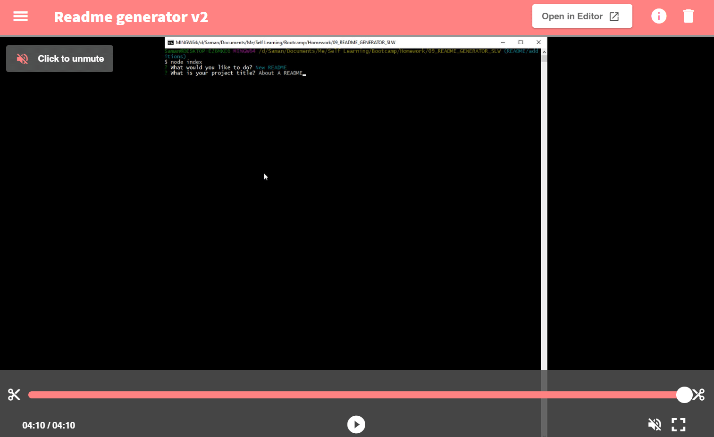
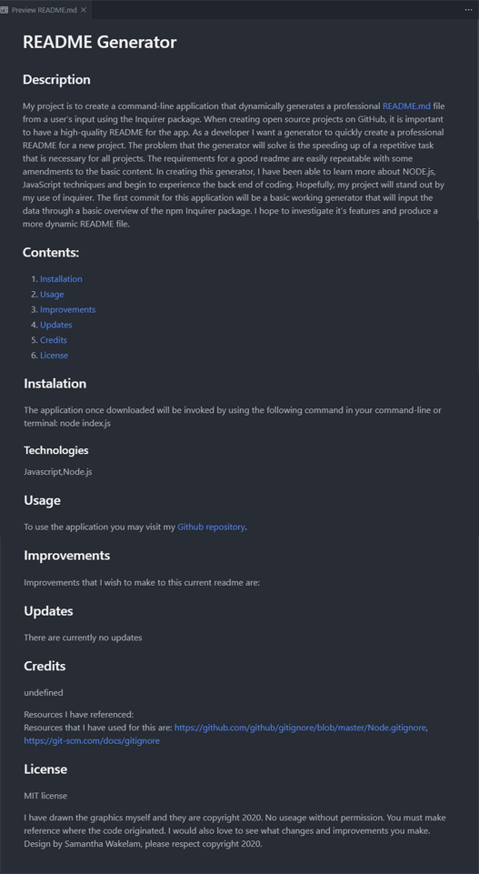
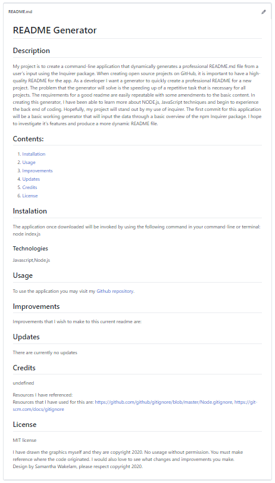
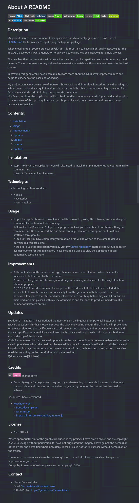

# About A README

 
 
 

## Description

My project is to create a command-line application that dynamically generates a professional README.md file from a user’s input using the Inquirer package.

When creating open source projects on GitHub, it is important to have a high-quality README for the app. As a developer I want a generator to quickly create a professional README for a new project. 

The problem that the generator will solve is the speeding up of a repetitive task that is necessary for all projects. The requirements for a good readme are easily repeatable with some amendments to the basic content. 

In creating this generator, I have been able to learn more about NODE.js, JavaScript techniques and begin to experience the back end of coding. 

My project stands out by my use of inquirer. I have used multidimensional questions by either using the ‘when’ command and ask again functions. The user should be able to input everything they need for a full readme with the odd finishing touch after the generation.  The first commit for this application will be a basic working generator that will input the data through a basic overview of the npm Inquirer package. I hope to investigate it’s features and produce a more dynamic README file. 

## Contents: 
1. [Installation](#Instalation) 
2. [Usage](#Usage)
3. [Improvements](#Improvements)
4. [Updates](#Updates)
5. [Credits](#Credits)
6. [License](#License)
7. [Contact](#Contact)

## Instalation

* Step 1: To install the application, you will also need to install the npm Inquirer using your terminal or command line.  
* Step 2: Type:  npm install inquirer. 

### Technologies 

The technologies I have used are:
* Node.js 
* Javascript 
* npm Inquirer 

## Usage

* Step 1: The application once downloaded will be invoked by using the following command in your command-line or terminal: node index.js.  
* Step 2: The program will ask you a number of questions within your command line. Be sure to read the questions carefully, there are a few option confirmations scattered throughout.  
* Step 3: Once you have completed your readme a file will be written to the same folder you downloaded this project to. .  
* Step 4: To use the application you may visit my [Github repository](https://github.com/Samwakelam/09_README_GENERATOR_SLW). There are no Github pages or live deployment for this application, I have included a video to view the application in use: .  

## Improvements

* Better utilisation of the Inquirer package, there are some nested features where I can utilise functions to better react to the user input.  
* Practise calling functions from organised pages containing and named for the single function where appropriate.  
* (21.11.2020) I need to improve the output of the readme a little better. I have included the screenshot of how the code is output exactly from the generator with the update. There are however a few places that still need user intervention to polish up before they can hit publish on their read me. I am pleased with my use of functions and for loops to produce markdown of a number of unknown entries.  

## Updates 

(Update: 18.11.2020) - Initial Commit images: these are screenshot directly after command-line application was created, no additional tweaks.

(Update: 21.11.2020) - I have updated the questions on the inquirer prompt to ask better and more specific questions. This has mostly improved the back-end coding though there is a little improvement on the user side. You can say if you want to add screenshots, updates, and improvements or not, and you can specify your type of licence followed by the exact version you wish. This outputs a badge for you at the top of the readme.   Code improvements broke the saved options from the users input into more manageable variables to be called upon when writing the readme. I have used functions in the template literals to call the data and loop through arrays outputting a user chosen number of steps, technologies, or resources. I have also used destructuring on the description part of the readme.   

Screenshot was taken directly after command-line application was created, no additional tweaks.

    
## Credits 

Thanks go to:
* Colum Lynagh - for helping to straighten my understanding of the node.js systems and running through ideas and theories on how to best organise my code for the output that I wanted to achieve. 

Resources I have referenced:   
* w3schools.com * freecodecamp.com * git-scm.com * https://github.com/SBoudrias/Inquirer.js 

## License 

* GNU GPL v3   

Where appropriate: 
Alot of the graphics included in my projects I have drawn myself and are copyright 2020. 
No useage without permission. 
If I have not originated the imagery I have gained the permission of the owner and acreditied 
where necessary. These are also not for re-purpose without permission of the owner.

You must make reference where the code originated. I would also love to see what changes and improvements you make.  
Design by Samantha Wakelam, please respect copyright 2020. 

## Contact

* Name: Sam Wakelam    Email: Sam.wakelam@hotmail.co.uk  Github Profile: https://github.com/Samwakelam

